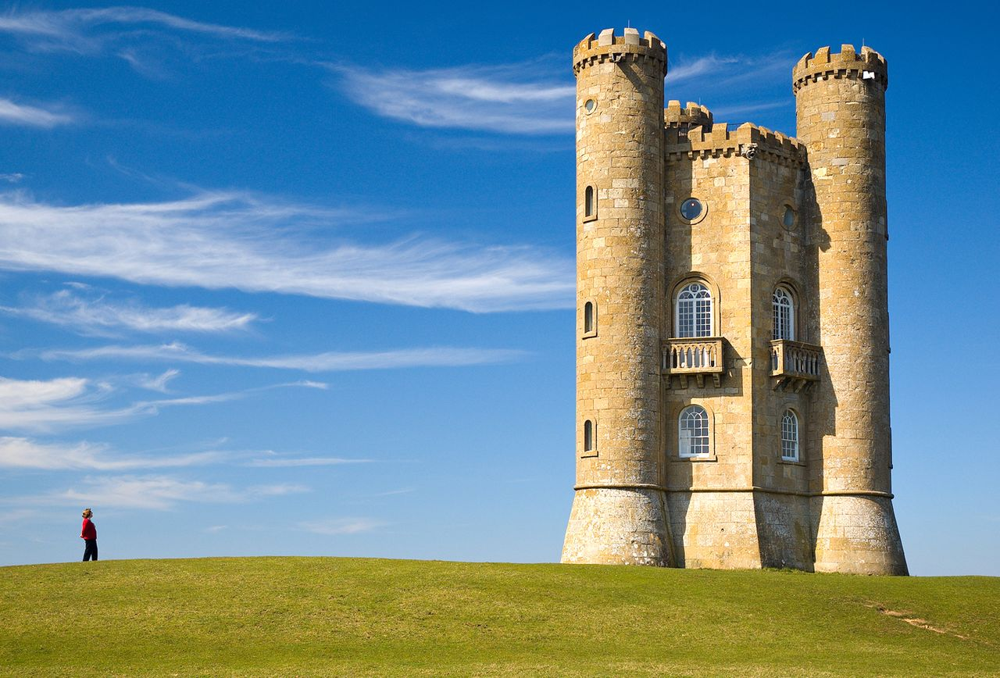

# Aya
#### 图像处理大作业 - Seam Carving

---

# 效果图

原图。

双向缩小20%之后的图片。

seam carving图。

更多功能参见本目录下的其他图片。

# 使用方法

    aya filename -o outputname [-m maskname] [-p processname] [-s scale]
    
其中：
- filename: 需要处理的图片名称。
- -o outputname: 输出文件名。
- -m maskname: 删除与保护的遮罩图层名。其中红色#ff0000表示删除，绿色#00ff00表示保护，其他颜色任意。默认不使用。
- -p processname: seam carving图的名称。默认不输出。
- -s scale: 缩放比率。放大scale%，若scale<0即表示缩小。默认值为-20，即缩小20%。

# 其他

本代码使用了OpenCV以进行图片读写和存储。